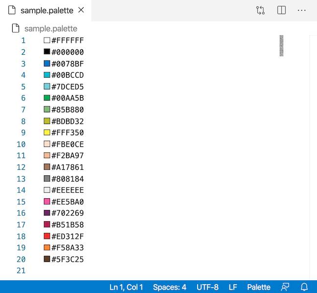

# Palette Support for Visual Studio Code

`*.palette` file support to [Visual Studio Code](https://code.visualstudio.com/) for showing colour decorator in front of all the colour text in editor.

## Release Notes

### 1.0.0

Initial release of `*.palette` file support for listing colours. Also show colour decorator for all valid colours in editor.
